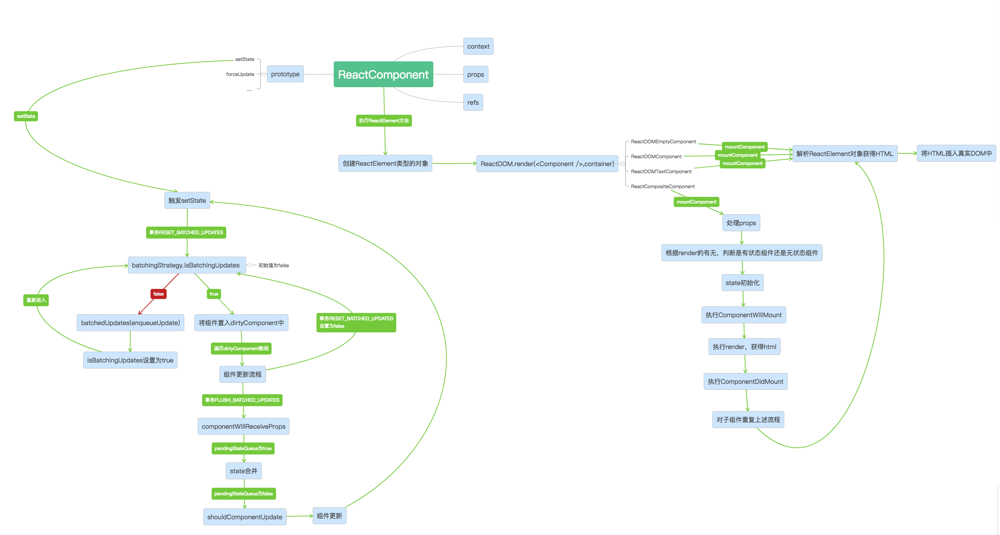
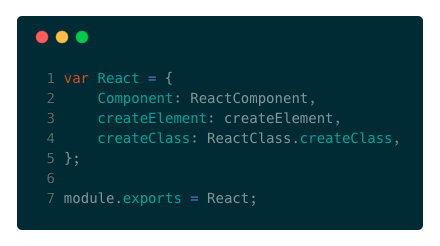
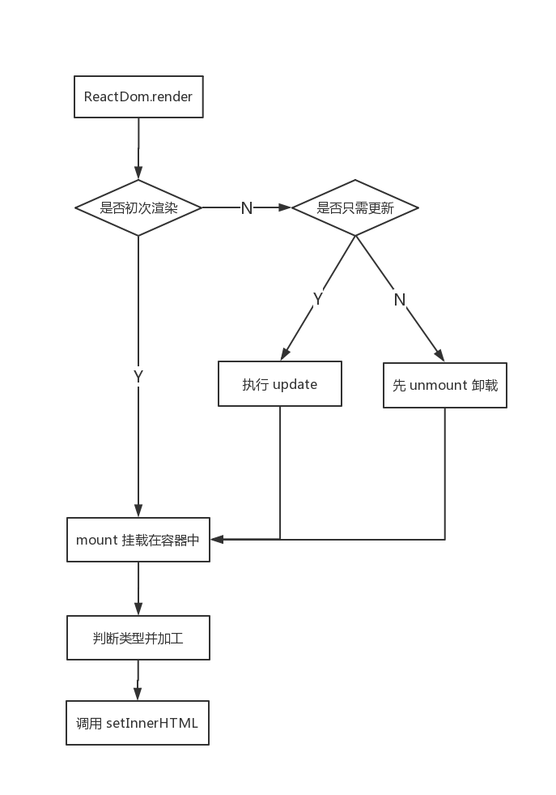
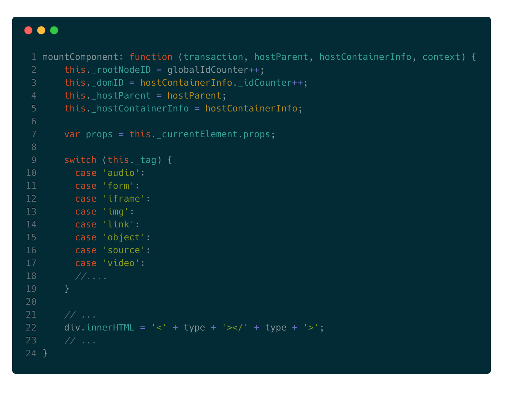
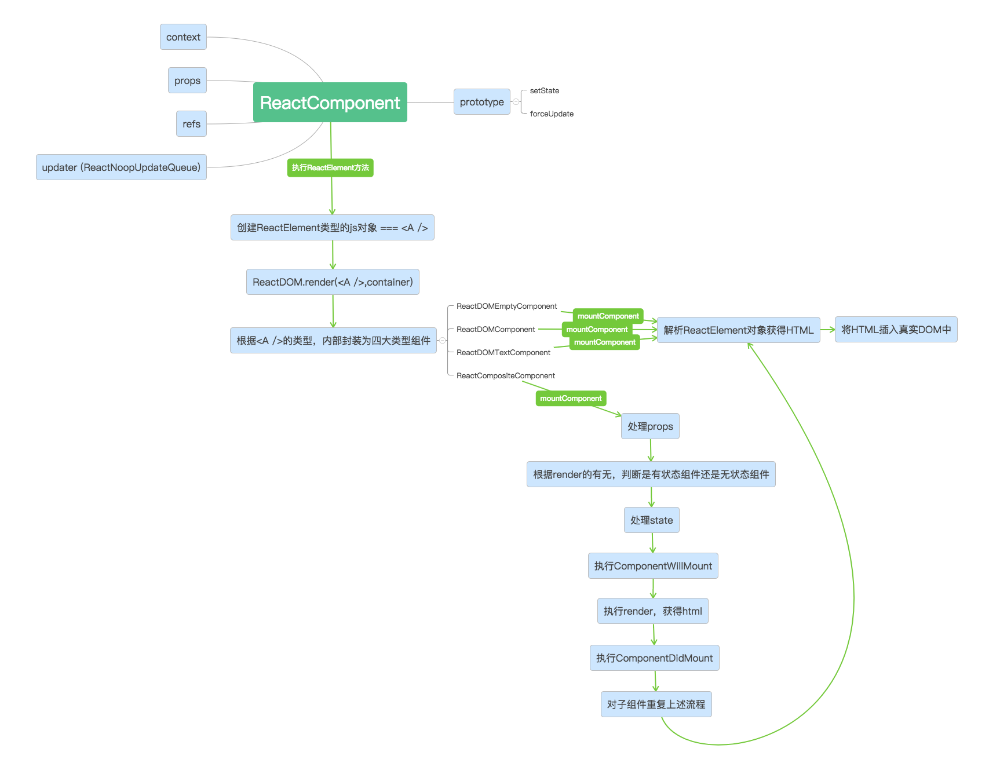
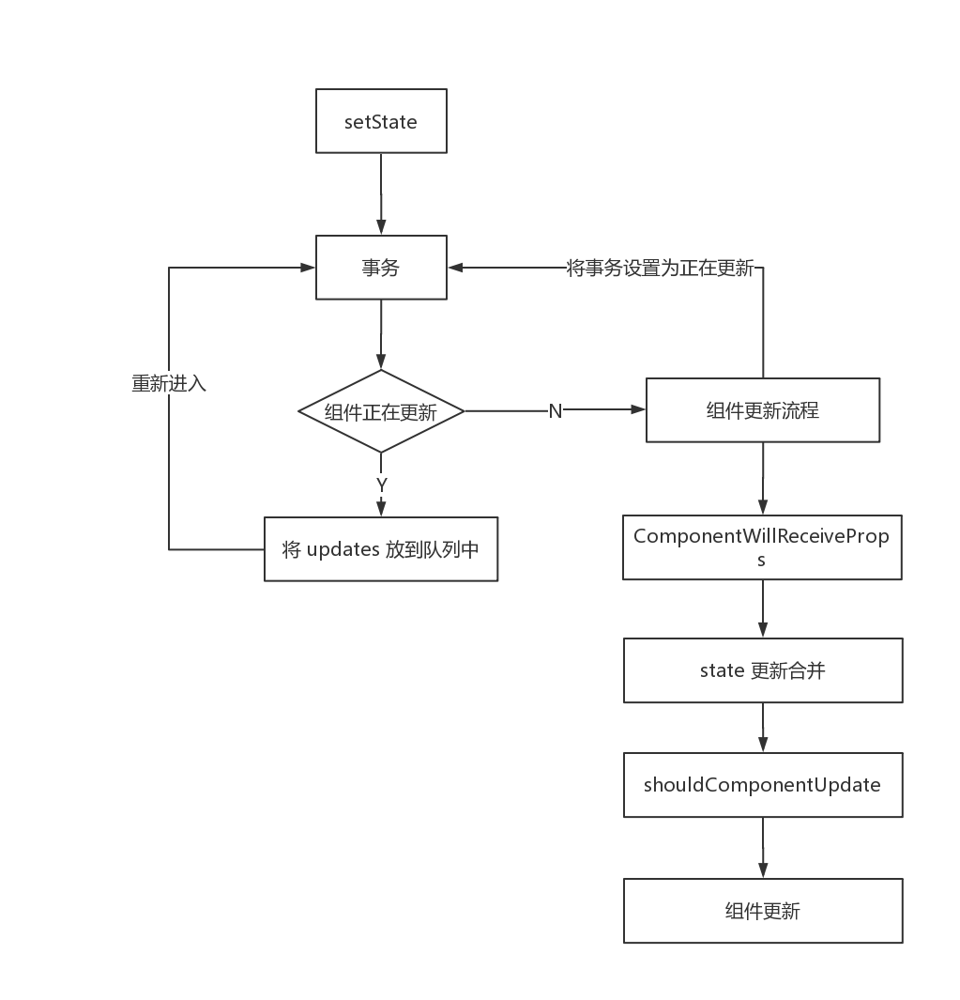
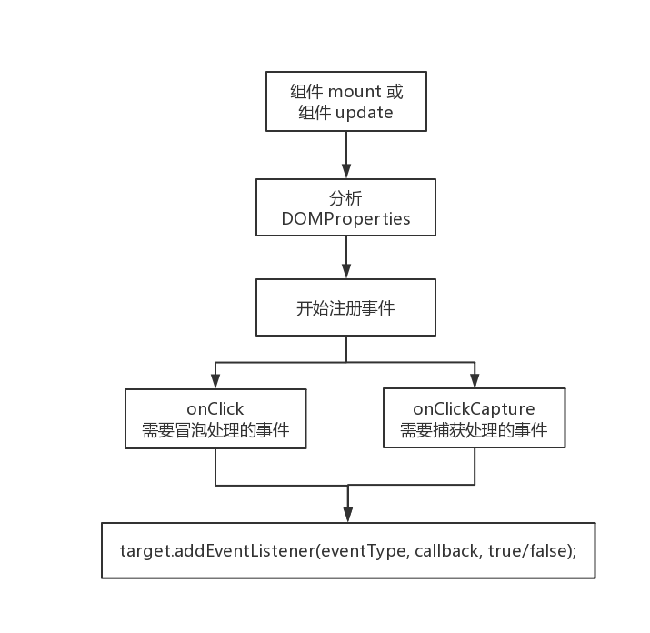
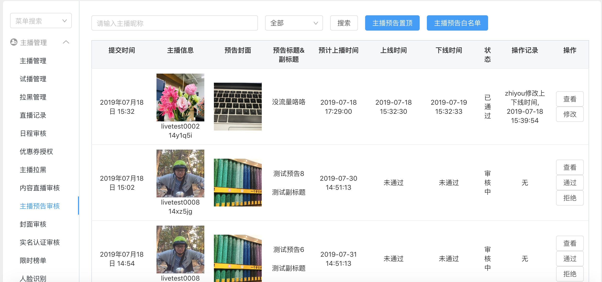

# React-15-stable Review

思维导图



## 一、组件的实现与挂载

### 1.组件是什么
编写一个最简单的 React 组件
```javascript
import React, { Component } from 'React';

class A extends Component {
    constructor(props){
        super(props);
        this.state = {};
    }
    
    render(){
       return <div>这是A组件</div>;
    } 
}
```

#### React.js


#### ReactComponent.js
```javascript
function ReactComponent( props, context, updater ) {
    this.props = props;
    this.context = context;
    this.refs = emptyObject;
    this.updater = updater || ReactNoopUpdateQueue;
}

ReactComponent.prototype.setState = function ( partialState, callback ) {
    //...
};

ReactComponent.prototype.forceUpdate = function ( callback ) {
	//...
};
```


#### 回看思维导图


## 2.组件的初始化

　　组件中的 `render()` 方法使用了 JSX ，JSX 只是为`React.createElement(component, props, ...children)`方法提供的语法糖。

```
// JSX语法
render(){
	return <div id='app'>这是A组件</div>;
} 
```

　　在 babel 编译后：

```
// babel 编译后：
render(){
    return React.createElement('div', {id: 'app'}, '这是A组件');
}
```


 `React.createElement` 方法创建出一个 `ReactElement` 类型的对象。

```javascript
const ReactElement = function(type, key, ref, self, source, owner, props) {
    
    const element = {
        // This tag allows us to uniquely identify this as a React Element
        $$typeof: REACT_ELEMENT_TYPE,
    
        type: type,
        key: key,
        ref: ref,
        props: props,
    
        // Record the component responsible for creating this element.
        _owner: owner,
    };

  	return element;
};

ReactElement.createElement = function(type, config, children) {
	//...
    
    return ReactElement(
        type,
        key,
        ref,
        self,
        source,
        ReactCurrentOwner.current,
        props,
    );
}
```

#### 虚拟 DOM

　　为什么创建的是一个 JavaScript 对象，而不直接创建真实的 DOM？

​	React 采用虚拟 DOM，即使用 JavaScript 对象模拟 DOM 对象。

　　调用浏览器 API 操作 DOM 的相对较慢，代价也较大。相比之下操作 JavaScript 对象就快速高效。因此 React 将真实 DOM 对象先解析为 JavaScript 对象（比如 ReactElement），更新时只需用 diff 算法比较新旧的 JavaScript 对象，做成一个 patch，最后将 patch 打到真实 DOM 上。

　　在频繁修改 DOM 的情况下保证了高效，可以看作是 JavaScript 和浏览器 DOM 间的缓存。


## 3.组件的挂载

　　我们知道可以通过`ReactDOM.render(component,mountNode)`的形式对 自定义组件进行挂载，那么挂载的过程又是如何实现的呢？



`shouldUpdateReactComponent`方法：

```javascript
// shouldUpdateReactComponent.js
function shouldUpdateReactComponent(prevElement, nextElement) {
    var prevEmpty = prevElement === null || prevElement === false;
    var nextEmpty = nextElement === null || nextElement === false;
    
    // 如果两者都为 null 或 false，则可以直接 update
    if (prevEmpty || nextEmpty) {
    	return prevEmpty === nextEmpty;
    }

    var prevType = typeof prevElement;
    var nextType = typeof nextElement;
    
    // 如果仅仅是数字或字符串，则可以直接 update
    if (prevType === 'string' || prevType === 'number') {
    	return nextType === 'string' || nextType === 'number';
    } else {
        // 否则判断 type 和 key 是否相等，若相等则可以直接 update
        return (
            nextType === 'object' &&
            prevElement.type === nextElement.type &&
            prevElement.key === nextElement.key
        );
    }
}
```


React 定义的四种组件类型及加工方式

| 组件内容     | 组件类型                      | 加工方式                                  |
| ------------ | ----------------------------- | ----------------------------------------- |
| 空           | `ReactEmptyComponent`组件     | 将参数设置为 null，返回类似`<!-->`的 HTML |
| 字符串或数字 | `ReactTextComponent`组件      |                                           |
| 虚拟 DOM     | `ReactDOMComponent`组件       |                                           |
| React 组件   | `ReactCompositeComponent`组件 |                                           |


### `ReactTextComponent`

```javascript
mountComponent(){
    //进行类似于 escapeHtml() 的转义
    var escapedText = escapeTextContentForBrowser(this._stringText);
    
    // 创建一个 DocumentFragment
    var lazyTree = document.createDocumentFragment();
    
    // 创建一个 textNode
    var textNode = document.createTextNode(this._stringText);

    // 将 textNode 放入 fragment 中
    lazyTree.appendChild(textNode);
    
    return lazyTree;
}
```


### `ReactDOMComponent`



### `ReactCompositeComponent`

```javascript
/**
 * ------------------ The Life-Cycle of a Composite Component ------------------
 *
 * - constructor: Initialization of state. The instance is now retained.
 *   - componentWillMount
 *   - render
 *   - [children's constructors]
 *     - [children's componentWillMount and render]
 *     - [children's componentDidMount]
 *     - componentDidMount
 *
 *       Update Phases:
 *       - componentWillReceiveProps (only called if parent updated)
 *       - shouldComponentUpdate
 *         - componentWillUpdate
 *           - render
 *           - [children's constructors or receive props phases]
 *         - componentDidUpdate
 *
 *     - componentWillUnmount
 *     - [children's componentWillUnmount]
 *   - [children destroyed]
 * - (destroyed): The instance is now blank, released by React and ready for GC.
 *
 * -----------------------------------------------------------------------------
 */

```


## 回看思维导图




 ##  二、组件状态的更新

组件有一个 updater 属性，存放了一个用于更新的队列。

```javascript
function ReactComponent( props, context, updater ) {
    this.props = props;
    this.context = context;
    this.refs = emptyObject;
    this.updater = updater || ReactNoopUpdateQueue;
}

ReactComponent.prototype.setState = function ( partialState, callback ) {
    //...
};

ReactComponent.prototype.forceUpdate = function ( callback ) {
	//...
};

```



  

## 三、React 事件系统

#### React 为什么要自己实现一个事件系统？

　　从**性能**和**兼容**两个方面来考虑。

　　首先从性能来说，React 通过对 vDOM 进行 diff 算法决定 DOM 树那些结点需要新增、替换或修改，假如直接在 DOM 结点插入原生事件监听，则会导致频繁的调用`addEventListener`和`removeEventListener`，造成性能的浪费。所以 React 采用了 **事件代理** 的方法，对于大部分事件而言都在 document 上做监听，然后根据 Event 中的 target 来判断事件触发的结点。

​	从兼容来说，对于不同的浏览器，React 帮我们统一了事件，做了浏览器的兼容。


#### 事件注册

在 JSX 中声明一个 React 事件十分简单，比如

```javascript
render() {
    return (
    	<div onClick={ event => console.log(event) } />
    );
}
```

注册过程：

	


#### 事件存储

react 事件系统维护了一个 listenerBank，是一个二维数组。

```javascript
/**
  * @param {object} inst 实例，它是事件的来源。
  * @param {string} registrationName 监听器的名称（例如`onClick`）。
  * @param {function} listener 存储的回调。
  */
putListener: function(inst, registrationName, listener) {
    //...
    var key = getDictionaryKey(inst);
    listenerBank[registrationName][key] = listener;
}

```


#### 事件触发

​	当事件触发时，document 上 addEventListener 注册的 callback 会被回调。但 react 加了一层包装，因此会调用包装的方法 `ReactEventListener.dispatchEvent()`。过程如下：

1. 找到事件触发的 DOM 和 React Component
2. 执行事件回调前，先由当前组件向上遍历它的所有父组件。得到 ancestors 这个数组。
3. 从当前组件向父组件遍历，依次执行注册的回调方法。这个顺序就是冒泡的顺序，并且我们发现不能通过`stopPropagation()`来阻止冒泡。

​	从上面的事件分发中可见，React 自身实现了一套冒泡机制。从触发事件的对象开始，向父元素回溯，依次调用它们注册的事件 callback。

 

#### 构造合成事件

根据事件类型的不同，合成不同的跨浏览器的`SyntheticEvent`对象的实例。

对于不同的事件，React 将使用不同的功能插件，这些插件都是通过依赖注入的方式进入内部使用的。

1. SimpleEventPlugin
2. EnterLeaveEventPlugin
3. ChangeEventPlugin
4. SelectEventPlugin
5. BeforeInputEventPlugin


#### 最后：事件处理


# React 性能优化


## 一、重写 shouldComponentUpdate 避免不必要的渲染

　　默认实现是返回 true，可以重写这个函数，通过返回 false 来避免重新渲染。如果父组件的`shouldComponentUpdate()` 返回了 false，那么也不会去渲染子组件。

```
shouldComponentUpdate(nextProps, nextState) {
  	return true;
}
```

　　或者可以将组件继承 `React.PureComponent` ，进行 props 和 state 的浅比较覆写了 `shouldComponentUpdate()` 的实现。


## 二、3 种事件绑定写法

必须谨慎对待 JSX 回调函数中的 `this`，在 JavaScript 中，class 的方法默认不会绑定`this`。

1. 构造函数内部 `bind()`

   ```javascript
   constructor(props){
       super(props);
       this.handleEdit = this.handleEdit.bind(this);
   }
   ```

2. jsx 中使用 `bind()` 

   ```jsx
   <button onClick={this.handleEdit.bind(this, param)}>编辑</button>
   ```

3. 箭头函数

4. ```jsx
   <button onClick={(param) => this.handleEdit(param)}>编辑</button>
   ```

第一种的性能最好。

* 第一种方法，只在构造函数执行时执行一遍
* 第二种方法，在每次`render()`的时候都会重新执行一遍函数
* 第三种方法，在每次`render()`的时候，都会生成一个新的箭头函数，即使两个箭头函数的内容是一样的


### 好物排行榜中的一个例子


```javascript
export default class Tab extends React.PureComponent {
    
    //..
    
}
```

```jsx
// mgj-live-goods-honor-list/content/index.jsx
export default class Content extends React.Component {
    
    //...
    
    changeTab(){
        //...
    }
    
    render(){
        return (
            <div>
                <Tab 
                    tabName={ item } 
                  	tabIndex={ index } 
                   	chooseTab={ chosenTab }
                   	changeTab={ this.changeTab.bind(this) }
                </Tab>
            </div>
        )
	}
}

```


## 三、通过指定 key 提高列表渲染效率

直播后台的列表：




　　目前都是使用数组的 index 作为 key，这样在数组添加或删除项时整个列表都要重新渲染（虽然一般做法是重新请求服务器拿数据）

